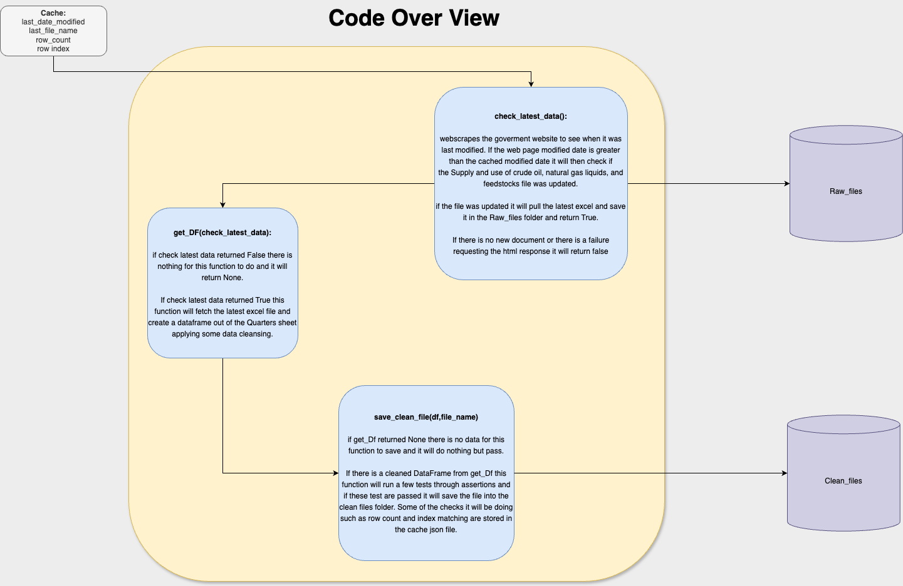
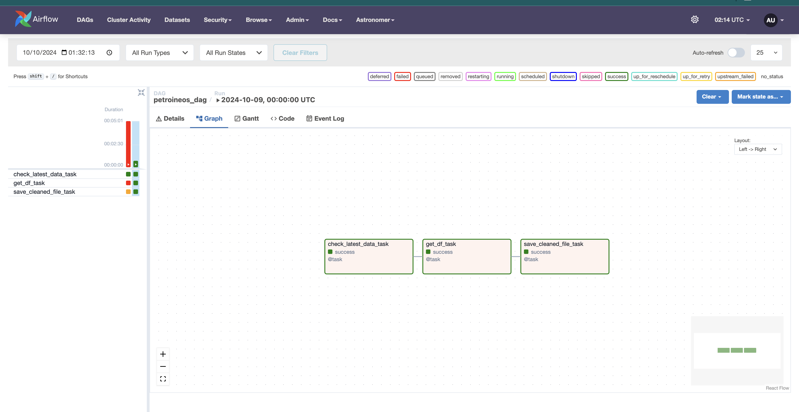

# Petroineos

## Folder Navigation:
* Clean_Files: holds final csv of cleaned data
* Raw_Files: holds Excel files of raw data extracted from goverment website
* Docs: Contains documentation outlining the project and images of pipelines runs and code overview.
* include: Contains main.py which is the python script where all of the functions where created
* dags: contains the Airflow dag scripts to run the pipeline

## How to run
*This project uses the Astro CLI for running Airflow locally.*
-- Prerequites: Must have docker installed

- Clone this repository to your local machine
- Create and activate a virtual environment
- pip install -r requirements.txt
- Create an Astro project using >> astro dev init
- Run Airflow locally using >> astro dev start
- Manually Trigger the dag pipeline to test

(Addiitonally there is a branch called master which has the code that is not in a schedule pipeline)

The project uses an Airflow pipeline that runs daily to check if the "Supply and use of crude oil, natural gas liquids, and feedstocks" file has been updated. If the file has been modified, the pipeline downloads the latest version and stores it. The updated file includes a new column for the latest quarter's data, in addition to all the previous data.

### How It Works
Daily Check: The pipeline checks if the file's URL has has been modified by comparing the last modified date on the url response to that cached in the code. If the last modified date on the response is greater than that cached it indicate that new data is available.
The code Then check if it was the "Supply and use of crude oil, natural gas liquids, and feedstocks" file that has been updated by comparing it with the file name that is cached.

### New file found

Data Storage: When a new file is detected, it is downloaded and saved alongside the previous files in a raw file folder. Each new file includes the complete dataset, with an added column for the most recent quarter.
File-Based Approach: Instead of updating an existing table or dataset, a new file is added for every update. The data is process and stored in the clean file folder this overwrites ecisting file in this folder.

## Airflow Run Result

### Pros
Automated Process: Airflow manages the entire pipeline, ensuring that the latest data is automatically checked and downloaded daily.
Clear Organization: Multiple raw files are present so if there was some structural changes tot he document it can be compared to historical ones easily.

### Cons
Storage Inefficiency: Every raw file includes all historical data plus the new quarter’s data, which leads to duplicated information and increased storage use. There is no version history for the cleaned csv.
Scalability Concerns: As more files are generated, the storage requirements and file management complexity increase.
Conclusion
While the Airflow-based pipeline is working well to automate the daily data checks and updates, the current file-based approach could be optimized to save on storage and improve efficiency as the dataset grows. Future enhancements could consider methods incolving delta tables and spark. PLease see DeltaTable.md for further information.

